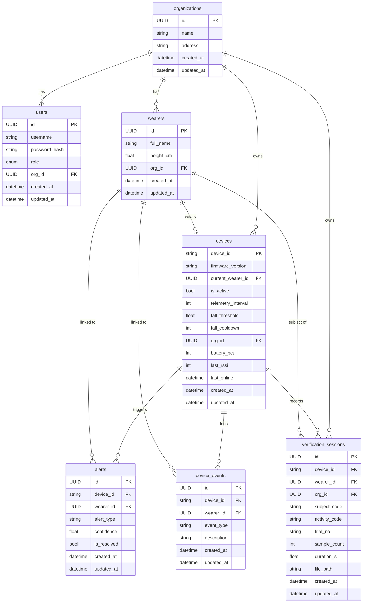

# PostgreSQL Schema — Quick Reference

> **Cập nhật lần cuối:** 2026-06-23
> Source of truth: `backend/HAR_and_Fall-detection-backend/app/models/domain.py`
> ERD hình vẽ: `REPORT/.../Hinhve/erd.png` — **cập nhật lại khi schema thay đổi** (xem Mermaid bên dưới)

---

## Bảng tóm tắt

| Bảng | PK | Cột chính | FK |
|---|---|---|---|
| `organizations` | `id` UUID | name, address | — |
| `users` | `id` UUID | username[unique], password_hash, role(ADMIN\|MANAGER) | org_id → organizations |
| `wearers` | `id` UUID | full_name, height_cm(float) | org_id → organizations |
| `devices` | `device_id` str | firmware_version, is_active, telemetry_interval(int,5s), fall_threshold(float,0.6), fall_cooldown(int,15s), battery_pct(int), last_rssi(int), last_online(datetime) | current_wearer_id[unique] → wearers, org_id → organizations |
| `alerts` | `id` UUID | alert_type, confidence(float), is_resolved(bool) | device_id → devices, wearer_id → wearers (nullable) |
| `device_events` | `id` UUID | event_type, description(nullable) | device_id → devices, wearer_id → wearers (nullable) |
| `verification_sessions` | `id` UUID | subject_code(str4 SVxx), activity_code(str3), trial_no(str3), sample_count(int,null), duration_s(float,null), file_path(str500,null) | device_id → devices, wearer_id → wearers (nullable, snapshot), org_id → organizations · idx: org_id, device_id |

> Tất cả bảng đều có `created_at`, `updated_at` (timezone-aware).
> ℹ️ Bảng `firmware_releases` (OTA) cũng tồn tại trong `domain.py` nhưng chưa liệt kê ở đây (drift cũ).

---

## Alembic Migrations (10 file)

| # | Revision ID | Nội dung |
|---|---|---|
| 1 | `4c400002ec88` | Initial schema: organizations, users, wearers, devices |
| 2 | `4686844feabb` | Add `created_at`/`updated_at` cho tất cả bảng |
| 3 | `56ec4e5d8c21` | Tạo bảng `alerts`, `device_events`; thêm `battery_pct`, `last_online` vào devices |
| 4 | `f1eda2d1e58f` | Add `org_id` FK vào devices (backfill + NOT NULL) |
| 5 | `cade8bab7f74` | Add `telemetry_interval` vào devices (default 5s) |
| — | `a7b3f9c1d2e4` | Add `fall_threshold` vào devices |
| — | `87ece1774913` | Add `fall_cooldown` vào devices |
| — | `1234567890ab` | Add `last_rssi` vào devices |
| — | `b2e9f4a1c3d7` | Tạo bảng `firmware_releases` (OTA) |
| 6 | `a8f3c2d1e9b5` | Tạo bảng `verification_sessions` (down_revision `cade8bab7f74`; + idx org_id, device_id) |

> ⚠️ **Thứ tự chain chưa rà lại:** 5 migration đầu xác định thứ tự rõ; 4 migration `fall_threshold`/`fall_cooldown`/`last_rssi`/`firmware_releases` đã có file (drift note cũ "không có migration" nay sai) nhưng vị trí trong chain + khả năng multi-head **cần kiểm tra `alembic heads` trước khi deploy lại**.

---

## Mermaid ERD (dùng để vẽ lại erd.png)

