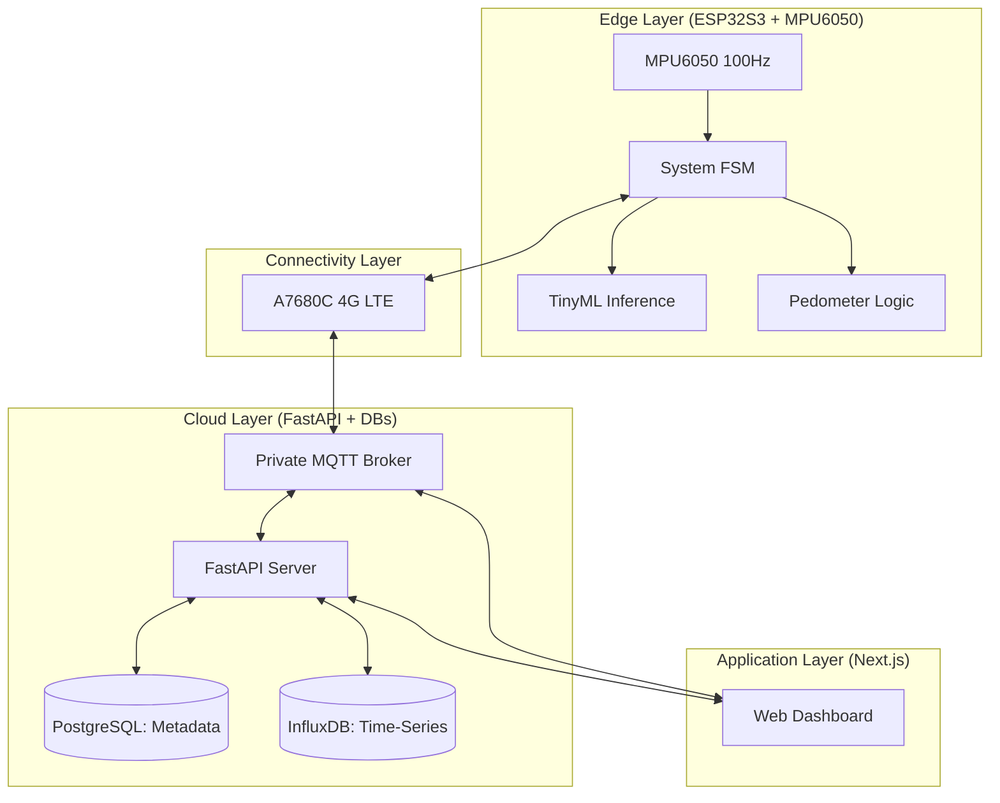

# [MASTER SPECIFICATION] HỆ THỐNG GIÁM SÁT NGƯỜI GIÀ & PHÁT HIỆN TÉ NGÃ (v2.0)

## 1. TỔNG QUAN DỰ ÁN
Hệ thống IoT đeo người (vị trí thắt lưng phía trước) giúp giám sát hành vi và phát hiện té ngã dựa trên cảm biến IMU. Hệ thống sử dụng kết nối 4G LTE ổn định, truyền dữ liệu về Cloud để quản lý tập trung và đưa ra cảnh báo thời gian thực trên Web Dashboard.

## 2. CHẾ ĐỘ HOẠT ĐỘNG (PROJECT PHASES)
- **PHASE 1: Data Collection & Training**: Firmware thu thập raw IMU (100Hz) chuyển về Backend để lưu trữ CSV và huấn luyện model TinyML.
- **PHASE 2: Edge Inference**: Deploy model TinyML lên ESP32S3. Thiết bị tự động nhận diện hành vi (HAR) và phát hiện té ngã (Post-impact fall detection) rồi gửi kết quả về Dashboard.

## 3. KIẾN TRÚC HỆ THỐNG (SYSTEM ARCHITECTURE)

## 4. TECH STACK BẮT BUỘC
- **Front-end**: Next.js (App Router), Tailwind CSS, Shadcn UI, Zustand, Recharts, TanStack Query.
- **Back-end**: FastAPI, PostgreSQL, InfluxDB.
- **Firmware**: ESP-IDF (C), MPU6050 (I2C 100Hz), A7680C (4G LTE over AT Commands), TF Lite for MCU.

## 5. ĐẶC TẢ CHI TIẾT CÁC MODULE

### A. Firmware (Edge Logic)
- **Vị trí đeo**: Thắt lưng phía trước.
- **Phát hiện té ngã (Post-impact)**: 
    - Trigger khi phát hiện va chạm (High G peak).
    - Phân tích dữ liệu sau va chạm (Orientation check) để xác nhận trạng thái nằm bất động.
    - Thời gian phản hồi: < 1s.
- **Đếm bước chân (Pedometer)**:
    - Thuật toán nhận diện bước chân dựa trên dữ liệu Gia tốc.
    - Phân loại và đếm riêng biệt: `walk_steps` và `run_steps`.
    - Firmware KHÔNG tính quãng đường để tiết kiệm tài nguyên.
- **Xác thực & Metadata**: 
    - MQTT Auth qua tài khoản/mật khẩu lĩnh.
    - Nhận và lưu trữ `user_name` từ Cloud để nhúng vào tin nhắn cảnh báo.

### B. MQTT Communication (Schema chuẩn)
... (Chi tiết tại protocol.md)

### C. Backend (Data Management)
- **Quản lý**: Tập trung vào vai trò `Manager` (Quản lý các thiết bị và người già trong Viện dưỡng lão).
- **Data Routing (Dual DB)**:
    - **PostgreSQL**: Lưu trữ Metadata (Users, Devices), Trạng thái định kỳ (Battery, Online/Offline) và Lịch sử cảnh báo té ngã (Alerts).
    - **InfluxDB**: Chỉ lưu trữ chuỗi thời gian (Time-Series) bao gồm số bước chân, quãng đường (tính toán dựa trên chiều cao lưu ở Postgres), và dữ liệu Raw IMU trong Phase 1 (Data Collection).
- **Xử lý dữ liệu**: 
    - Tính toán quãng đường: `Distance = (walk_steps * L_walk) + (run_steps * L_run)`. Trong đó các hệ số bước đi/chạy dựa trên chiều cao người dùng lưu trong PostgreSQL.
    - Ghi nhận `walk_steps` và `run_steps` định kỳ vào InfluxDB để phục vụ vẽ biểu đồ lịch sử.

### D. Frontend (UI/UX Screens)
Hệ thống Frontend gồm 4 màn hình chính:
1. **Dashboard (Tổng quan)**: 
   - Giám sát 100 thiết bị đồng thời (Grid/Table view).
   - **Alerts (Real-time)**: Kết nối trực tiếp qua WebSockets (WSS) tới MQTT Broker. Hiển thị cảnh báo té ngã (Overlay đỏ + Âm thanh) ngay lập tức.
   - **Telemetry**: Gọi API Backend cập nhật mỗi 1 phút để lấy dữ liệu pin, số bước đi, trạng thái online.
2. **Patient Management (Quản lý người bệnh)**:
   - Thêm/Sửa/Xóa hồ sơ người già. Quan trọng nhất là trường `height_cm` để Backend nội suy độ dài bước chân.
3. **Wear Device (Quản lý thiết bị)**:
   - Đăng ký thiết bị mới (bằng MAC/MQTT Client ID).
   - Chức năng Gán (Assign) thiết bị cho một `Patient` cụ thể.
4. **Alert History (Lịch sử)**:
   - Truy vấn và hiển thị lịch sử cảnh báo té ngã.
   - Vẽ biểu đồ (Recharts) thống kê số bước chân và quãng đường di chuyển theo ngày/tuần.

## 6. QUY CÁCH PHÁT TRIỂN
1. **Modularity**: Code Firmware và Backend phải chia module rõ ràng (VD: module nút nhấn dự phòng, module giao tiếp LTE tách biệt).
2. **Event-driven**: Sử dụng Event Loop và FSM để quản lý luồng xử lý, tránh blocking code.
3. **Strict Scope**: Không thêm tính năng ngoài Đặc tả (ví dụ: GPS, Bluetooth) để đảm bảo ổn định 4G LTE.