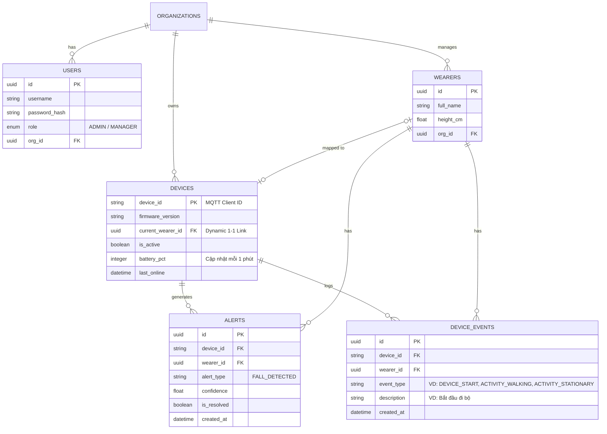

# DATABASE SCHEMA SPECIFICATION

Tài liệu này đặc tả cấu trúc cơ sở dữ liệu cho hệ thống giám sát người già theo mô hình Dual-Database (PostgreSQL cho Relational/Events và InfluxDB cho Time-Series).

---

## 1. RELATIONAL DATABASE (PostgreSQL)
Hệ quản trị CSDL quan hệ dùng để quản lý metadata, người dùng, thiết bị, trạng thái hiện tại và lịch sử cảnh báo (Alerts).

### 1.1 Sơ đồ thực thể quan hệ (ERD)

### 1.2 Chi tiết các bảng

#### Bảng `organizations`
- Lưu trữ thông tin chi nhánh/viện dưỡng lão.

#### Bảng `users`
- Lưu trữ tài khoản truy cập cho Quản lý (Manager) hoặc Quản trị viên (Admin).
- `org_id` dùng để giới hạn phạm vi quản lý của Manager.

#### Bảng `wearers`
- Lưu hồ sơ người già cần giám sát. 
- `height_cm` là thông số quan trọng để Backend nội suy quãng đường di chuyển.

#### Bảng `devices`
- Lưu danh mục phần cứng và trạng thái hiện tại (Pin, Online). 
- `current_wearer_id`: Cho phép gán/hủy gán thiết bị cho người đeo linh hoạt.

#### Bảng `alerts`
- Lưu trữ lịch sử cảnh báo (Té ngã) từ thiết bị đẩy lên qua MQTT.
- Hỗ trợ nghiệp vụ truy vấn lịch sử hoặc Dashboard thống kê các vụ té ngã chưa được xử lý (`is_resolved`).

#### Bảng `device_events` (Activity Log)
- Lưu trữ nhật ký hoạt động (Timeline) để hiển thị lên UI "Recent Activity Log" như: Thiết bị khởi động, Bắt đầu đi bộ, Đứng yên, v.v.
- Tần suất: Chỉ tạo record khi có **sự chuyển đổi trạng thái** (State transition) thay vì lưu liên tục.

---

## 2. TIME-SERIES DATABASE (InfluxDB)
Chỉ tập trung vào việc lưu trữ dữ liệu chuỗi thời gian (có tính liên tục và số lượng lớn).

### 2.1 Measurement: `telemetry` (Phase 2 - Production)
Lưu trữ thông tin vận động định kỳ để vẽ biểu đồ lịch sử di chuyển (Pedometer).
- **Tags (Được index, dùng để filter/group)**:
  - `device_id` (MAC Address)
  - `wearer_id` (UUID của Patient)
- **Fields (Dữ liệu thực tế)**:
  - `walk_steps` (integer) - Số bước đi bộ
  - `run_steps` (integer) - Số bước chạy
  - `distance_m` (float) - Quãng đường di chuyển (Backend tính toán từ steps và height_cm)
- **Timestamp**: Ghi nhận lúc thiết bị gửi dữ liệu lên.

### 2.2 Measurement: `imu_raw` (Phase 1 - Data Collection)
Lưu trữ dữ liệu IMU thô (Raw Data) được gửi lên theo lô (Batching) để phục vụ việc huấn luyện/đánh giá mô hình TinyML. Measurement này sẽ KHÔNG có dữ liệu khi chạy thực tế (Production).
- **Tags**:
  - `device_id` (MAC Address)
  - `session_id` (Mã ID của phiên thu thập do Web tạo ra)
  - `label` (Nhãn hành động - ví dụ: walking, running, falling)
- **Fields**:
  - `ax`, `ay`, `az` (float) - Gia tốc 3 trục (Accelerometer)
  - `gx`, `gy`, `gz` (float) - Vận tốc góc 3 trục (Gyroscope)
- **Timestamp**: Ghi nhận thời gian thực tế của từng mẫu dữ liệu (thường nội suy từ timestamp của Batch).
