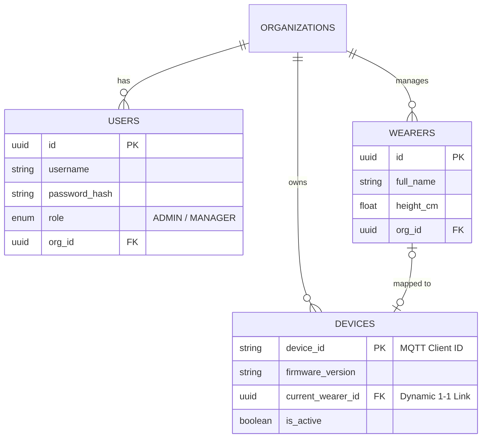

# DATABASE SCHEMA SPECIFICATION

Tài liệu này đặc tả cấu trúc cơ sở dữ liệu cho hệ thống giám sát người già.

---

## 1. RELATIONAL DATABASE (PostgreSQL)
Hệ quản trị CSDL quan hệ dùng để quản lý metadata, người dùng, thiết bị và các mối liên kết.

### 1.1 Sơ đồ thực thể quan hệ (ERD)

### 1.2 Chi tiết các bảng

#### Bảng `organizations`
- Lưu trữ thông tin chi nhánh/viện dưỡng lão.

#### Bảng `users`
- Lưu trữ tài khoản truy cập cho Quản lý (Manager) hoặc Quản trị viên (Admin).
- `org_id` dùng để giới hạn phạm vi quản lý của Manager.

#### Bảng `wearers`
- Lưu hồ sơ người già cần giám sát. 
- `height_cm` là thông số quan trọng để Backend tính toán quãng đường di chuyển.

#### Bảng `devices`
- Lưu danh mục phần cứng. 
- `current_wearer_id`: Cho phép gán/hủy gán thiết bị cho người đeo linh hoạt.

---

## 2. TIME-SERIES DATABASE (InfluxDB)
(Sẽ được bổ sung chi tiết ở các bước sau)
